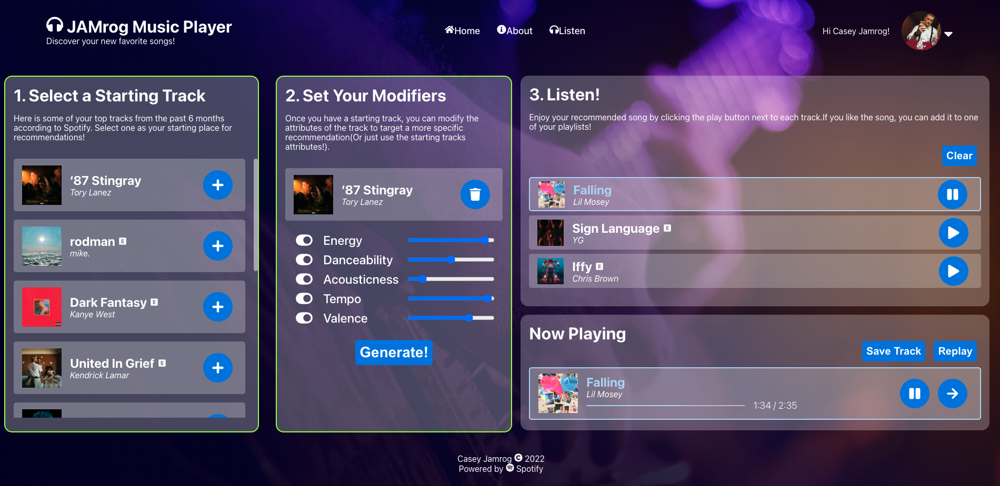

# Jamrog Music Player

Introducing a fun way to find new music! The JAMrog Music Player is a personal project I created to demonstrate and practice my skills using React, Node, and utilizing a public API. 

This application runs as a simple single page application on a localhost (at the moment) that connects to the Spotify Web Playback API to play music and generate new recommended tracks based on your selected criteria.



## Installation
1. Clone this repository:
```bash
git clone https://github.com/caseyjamrog/jamrog-music-player.git
```
2. Install all server dependencies:
```bash
npm install
```
3. Install all react dependencies and build static files:
```bash
cd client
npm install
npm run build
```
4. Run the front-end and back-end applications using concurrently and npm 'prod' script listed in the package.json file:
```bash
cd ..
npm run prod
```
## Usage

The process is simple:
1. **Select a Starting Track** 
    - When you log into the app with your spotify account, the app will automatically retrieve your 'top' 10 tracks from spotify in the last 6 months (I dont get to choose how they select them, so youll just have to go with it). From the list, just click the blue "+" icon and the app will move you to the next step.
2. **Set Your Modifiers**
    - Once your starting track is selected, you will be given a series of modifiers you can modify as you see fit. The initial values are populated from the starting track you selected.
    - The modifiers are:
        - Energy: Energy represents a perceptual measure of intensity and activity. Typically, energetic tracks feel fast, loud, and noisy. For example, death metal has high energy, while a Bach prelude scores low on the scale.
        - Danceability: Danceability describes how suitable a track is for dancing based on a combination of musical elements including tempo, rhythm stability, beat strength, and overall regularity.
        - Acousticness: A confidence measure of whether the track is acoustic.
        - Tempo: The overall estimated tempo of a track in beats per minute (BPM). In musical terminology, tempo is the speed or pace of a given piece and derives directly from the average beat duration.
        - Valence: A measure that describes the musical positiveness conveyed by a track. Tracks with high valence sound more positive (e.g. happy, cheerful, euphoric), while tracks with low valence sound more negative (e.g. sad, depressed, angry).
3. **Generate your Recommendations!**
    - Click the 'Generate!' button, and the app will grab 3 recommended songs according to your starting track and target modifiers. The first recommendation will automatically start playing.
    - If you like the currently playing track, you can choose 'Save Track' and it will automatically add it to your saved tracks in Spotify for later

4. **Bonus:** If you want to listen to one of your top tracks, just hover and click on the track name and it will start playing!

## Prerequisites
Due to the limitations of the spotify API, each user is required to have a premium spotify account to fully interact with the application.

### Creating a Spotify Developer account and Application
In order to use the Spotify API, you also need to create a developer account at [https://developer.spotify.com/](https://developer.spotify.com/).

After youve created your account, you need to create a new spotify application at [https://developer.spotify.com/dashboard/applications](https://developer.spotify.com/dashboard/applications). This will provide you a api ID and secret that allows you to connect to Spotify.

Make sure to configure your application with your respective callback function, or it wont be able to authenticate back to your app! If you are using the default callback I have configured, you will want to use http://localhost:8888/auth/callback.

### Storing API ID and Secret in .env
Once you have the spotify id and secret for your app, create a new file at your server directory named '.env'. This is where you will store the credentials. Edit this file with your credentials like this:
```
SPOTIFY_API_ID=<YOUR APP ID>
SPOTIFY_API_SECRET=<YOUR APP SECRET>
```

## Project Roadmap
Here are some improvements I want to make in future updates
- Finish reauthentication sequence automatically if the token expires so the user doesnt need to log in again.
- Make the User Interface mobile-friendly. Currently its only built for desktop.
- Add a search feature just to search for new songs you want to listen to.
- Convert application to run using Docker containers for better production quality code
- Many more...


## Contact
Feel free to contact me by email or on linkedin!

Casey Jamrog

caseyjamrog@gmail.com

[https://linkedin.com/in/caseyjamrog](https://linkedin.com/in/caseyjamrog)

## Acknowledgements

I couldnt complete this project without a lot of assistance from various internet resources, documentation & open-source node packages. 